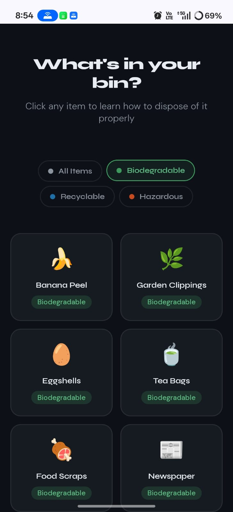
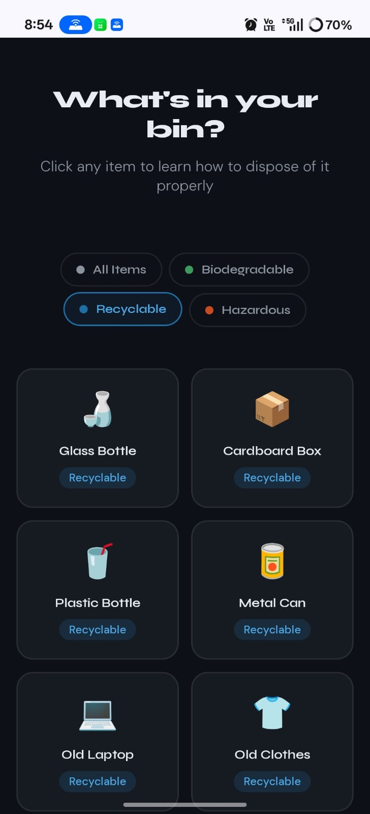
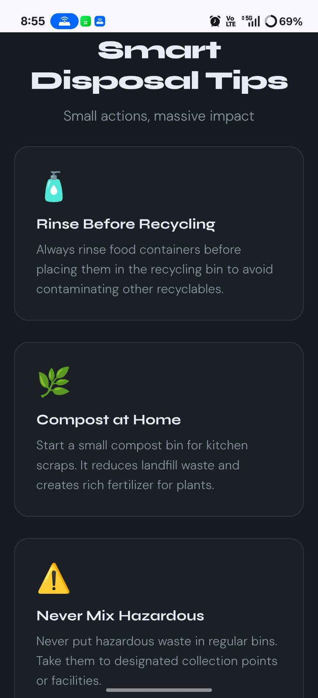
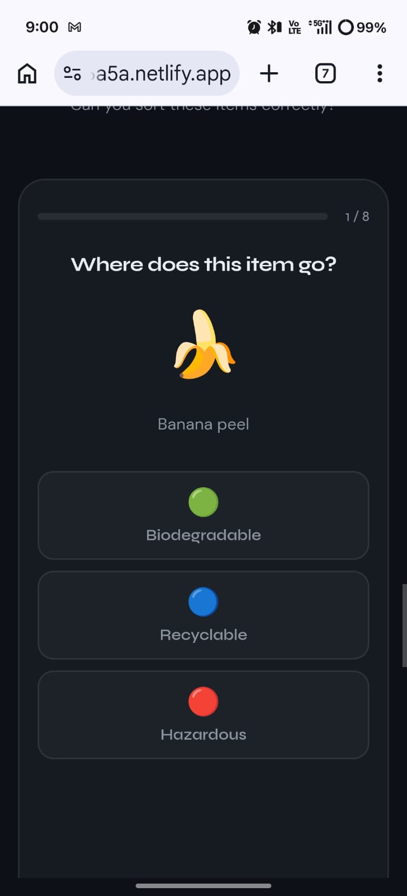

# ♻️ SortRight

### Smart Waste Segregation Awareness Platform

An interactive website that teaches people how to correctly sort waste using visual cards, disposal guides, and quizzes.

🌐 **Live Demo**  
https://visionary-dusk-a46a5a.netlify.app

---

## 📑 Table of Contents

- Overview
- Screenshots
- Features
- Waste Categories
- Tech Stack
- Getting Started
- Project Structure
- Deployment
- Future Improvements
- License

---

## 🌍 Overview

**SortRight** is a responsive educational web application designed to teach proper waste segregation.

Instead of long informational pages, users interact with waste items and instantly learn:

- 🗑️ Where the waste belongs  
- ♻️ How it should be disposed  
- 🌱 Why proper segregation matters  

The goal is simple: make waste education **visual, interactive, and memorable**.

> The world generates **2.01 billion tonnes of waste every year.**  
> Nearly **75% could be recycled if properly sorted.**

---

## 📸 Screenshots

### Biodegradable Waste Cards

### Recyclable Waste Cards

### Smart Disposal Tips

### Quiz Section

### Landing Page

---

## ✨ Features

- 🗂️ **Interactive Waste Cards**  
  18 waste items displayed as clickable cards. Each card opens a disposal guide.

- 🔍 **Category Filtering**  
  Users can filter waste items by type:
  - 🟢 Biodegradable
  - 🔵 Recyclable
  - 🔴 Hazardous

- 🗑️ **Know Your Bins**  
  Clear explanation of what belongs in each waste bin.

- 🧠 **Gamified Quiz**  
  8-question quiz with instant score and explanations.

- 💡 **Practical Disposal Tips**  
  Real-life tips to improve everyday waste habits.

- 📱 **Fully Responsive**  
  Works smoothly on mobile, tablet, and desktop devices.

---

## ♻️ Waste Categories

| Category | Examples |
|--------|--------|
| 🟢 Biodegradable | Banana peel, eggshells, food scraps |
| 🔵 Recyclable | Plastic bottles, cardboard, metal cans |
| 🔴 Hazardous | Batteries, medicines, CFL bulbs |

---

## 🛠 Tech Stack

| Technology | Purpose |
|-----------|-----------|
| HTML5 | Website structure |
| CSS3 | Styling and layout |
| JavaScript | Interactivity and quiz logic |
| Google Fonts | Typography |

No frameworks were used.  
This project focuses on **clean core web technologies**.

---

## 🚀 Getting Started

### Prerequisites

Install:

- VS Code
- Live Server Extension

---

### Run Locally

Clone the repository

git clone https://github.com/ApurvaPatil96/sortright.git

Open the project folder in **VS Code**.

Right click **index.html**

Select **Open with Live Server**

Then open in browser:

http://127.0.0.1:5500/index.html

No installation required.

---

## 📂 Project Structure

sortright
│
├── index.html
│
├── css
│ └── style.css
│
├── js
│ ├── data.js
│ ├── modal.js
│ ├── quiz.js
│ └── main.js
│
└── screenshots
├── Biodegradable-cards.jpeg
├── Recyclable-cards.jpeg
├── Tips.jpeg
├── Quiz.jpeg
└── Landing Page.jpeg

---

## 🌐 Deployment

### Netlify

Upload the project folder to **Netlify** to generate an instant live link.

### GitHub Pages

Go to:

Settings → Pages → Main Branch

Your project will be available at:

ApurvaPatil96.github.io/sortright

---

## 🔮 Future Improvements

- 🔎 Add search functionality
- 🌐 Support regional languages
- ➕ Increase waste items to 50+
- 🎮 Drag-and-drop waste sorting game
- 📤 Share items via WhatsApp

---

## 📄 License

This project is open source and available under the **MIT License**.

---

🌍 **Every correctly sorted item helps protect the planet**

